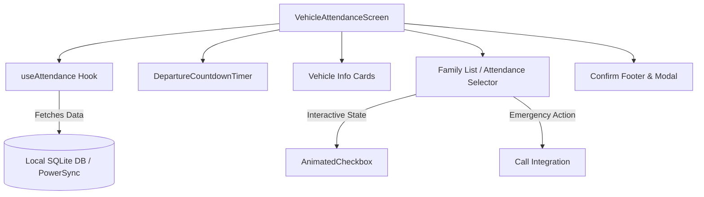

# 🚐 Vehicle and Attendance System Documentation

This document outlines the **Vehicle and Attendance Tracking System** in **TrackMyTrip**, highlighting the system architecture, component breakdown, database interactions, visual states, and troubleshooting best practices.

---

## 📌 Feature Overview

The **Vehicle and Attendance System** is a mission-critical, offline-first subsystem designed to coordinate and track the departure status of all travelers across different transportation legs (Flights, Trains, Cabs, and Buses). 

It empowers trip organizers and travelers to:
1. **Track active departure schedules** using real-time countdown timers.
2. **Review detailed vehicle and ticket information** (seats, berths, meal preferences, driver contacts, PNR numbers).
3. **Verify and record attendance/boarding statuses** of all group members, syncing state instantly via an offline-first SQLite database.
4. **Initiate quick actions** like calling absent travelers, checking in, and opening external URLs for ticket status.

---

## 🏗️ Architecture & Component Breakdown



### 1. Main Screens & Controllers
* **`VehicleAttendanceScreen.tsx`**: The main user interface orchestrating tabs for different trip days, dynamic horizontal sliders for multiple legs, checklist views of travelers, and a persistence action bar.

### 2. Business Logic Controllers (Hooks)
* **`useAttendance.ts`**: The central state controller that calculates:
  * `currentDay`: Current active day index of the trip based on today's calendar date offset from the trip's `start_date`.
  * `allLegs`: Chronologically sorted array of all travel legs (`vehicles` table records).
  * `currentLeg`: Derives the upcoming/active leg occurring closest to the current time.

### 3. Sub-Components
* **`DepartureCountdownTimer.tsx`**: A precise countdown utility displaying hours, minutes, and seconds remaining until departure.
  * *High-frequency ticking*: Employs a 1-second interval using `differenceInSeconds` from `date-fns`.
  * *Visual urgency levels*: Color-coded alerts and micro-animations dynamically adjusted according to remaining seconds.
* **Vehicle Info Cards**:
  * `FlightCard.tsx`: Displays Airline, Flight No, Gate, Terminal, Seats, PNRs, and meal preferences.
  * `TrainCard.tsx`: Displays Train name, Coach, Seat/Berth allocation, and PNR codes.
  * `BusCard.tsx`: Shows operator name, boarding point details, and vehicle license numbers.
  * `CabCard.tsx`: Shows cab provider, vehicle class, license plate, driver name, and direct contact hooks.
* **`TransportTimeline.tsx`**: Renders a vertical layout showcasing the absolute journey route progression across all trip legs.
* **`SelfCheckInSection.tsx`**: Handles independent self-check-in flows for individual travellers.

---

## 💾 SQLite Database Schema

The subsystem interacts with four relational tables synchronized via the **PowerSync SDK**:

### 1. `vehicles`
Stores details of scheduled travel legs:
```sql
CREATE TABLE vehicles (
  id TEXT PRIMARY KEY,
  trip_id TEXT NOT NULL,
  transport_type TEXT CHECK(transport_type IN ('bus', 'flight', 'train', 'cab')),
  trip_day INTEGER NOT NULL,
  leg_order INTEGER NOT NULL,
  departure_place TEXT,
  arrival_place TEXT,
  departure_time TEXT, -- HH:MM format
  arrival_time TEXT,
  driver_name TEXT,
  driver_phone TEXT,
  vehicle_number TEXT,
  airline_name TEXT,
  flight_number TEXT,
  terminal TEXT,
  gate TEXT,
  train_number TEXT,
  train_name TEXT,
  coach TEXT,
  berth_type TEXT,
  cab_company TEXT,
  cab_type TEXT,
  cab_number TEXT,
  cab_driver_name TEXT,
  cab_driver_phone TEXT,
  cab_sharing INTEGER DEFAULT 0,
  pnr_number TEXT
);
```

### 2. `pax`
Represents the travelers in a group:
```sql
CREATE TABLE pax (
  id TEXT PRIMARY KEY,
  user_id TEXT,
  name TEXT NOT NULL,
  phone TEXT,
  email TEXT
);
```

### 3. `pax_vehicles`
Connects travelers to their specific assigned seats/tickets per vehicle leg:
```sql
CREATE TABLE pax_vehicles (
  pax_id TEXT NOT NULL,
  vehicle_id TEXT NOT NULL,
  seat_number TEXT,
  berth_number TEXT,
  pnr_number TEXT,
  role TEXT CHECK(role IN ('PRIMARY', 'SECONDARY')),
  meal_preference TEXT,
  PRIMARY KEY (pax_id, vehicle_id)
);
```

### 4. `attendance`
Persists the final checked-in/boarding statuses of group members:
```sql
CREATE TABLE attendance (
  pax_id TEXT NOT NULL,
  vehicle_id TEXT NOT NULL,
  checked_in_at TEXT, -- Timestamp
  status TEXT CHECK(status IN ('Checked In', 'Gone / Missing', 'Not Boarded', 'Absent')),
  via_rep INTEGER DEFAULT 0, -- 0 = self check-in, 1 = checked in by primary traveler on behalf
  PRIMARY KEY (pax_id, vehicle_id)
);
```

---

## ⏱️ Real-time Departure Timer Logic

### 🗓️ Multi-day Target Calculation
Because SQLite stores departure times strictly as `HH:MM` time strings (e.g. `'09:45'`), the absolute calendar target time is dynamically computed in the UI relative to the trip's day offset using the following formula:

$$\text{Target Departure Date} = \text{Current Local Date} + (\text{leg.trip\_day} - \text{currentDay})$$

This is safely implemented in the screen controller:
```typescript
const getDepartureISO = (timeStr?: string, tripDay?: number) => {
  if (!timeStr) return null;
  try {
    const [h, m] = timeStr.split(":").map(Number);
    const d = new Date();
    d.setHours(h, m, 0, 0);
    if (tripDay !== undefined && currentDay !== undefined) {
      const diffDays = tripDay - currentDay;
      d.setDate(d.getDate() + diffDays);
    }
    return d.toISOString();
  } catch {
    return null;
  }
};
```

### 🚨 Timer Severity & Alert States

The departure countdown features three warning stages based on remaining duration:

| Timer Duration | Status | Visual Style | Animation Behavior | Label Text |
| :--- | :--- | :--- | :--- | :--- |
| **> 30 mins** | `Normal` | 🟢 Green background | Flat opacity (1.0) | *"[Vehicle] departs in"* |
| **15 to 30 mins**| `Warning`| 🟡 Yellow background | Flat opacity (1.0) | *"[Vehicle] departs soon — hurry up!"* |
| **< 15 mins** | `Urgent` | 🔴 Red background | Flashing opacity animation (400ms repeat sequence) | *"[Vehicle] departs soon — board now!"* |
| **<= 0 mins** | `Departed`| ⚪ Gray background | Stopped animation (1.0 opacity) | *"[Vehicle] has departed"* |

---

## 💡 Troubleshooting: The "UI Stuck / Thread Lockup" Trap

### ❓ Why does the UI lock up or freeze?
A common issue in React/React Native apps using database adapters (like PowerSync or SQLite) is the **Infinite Rendering Loop Trap**. 

Consider this problematic code fragment in a dashboard component:
```typescript
// ❌ WRONG: Causes the entire application thread to freeze and lock up
const db = usePowerSync();
const [counts, setCounts] = useState(initialCounts);

useEffect(() => {
  const fetchCounts = async () => {
    const res = await db.getAll("SELECT count(*) FROM hotels WHERE trip_id = ?", [tripId]);
    setCounts({ lodging: res[0].cnt });
  };
  fetchCounts();
}, [tripId, db]); // ⚠️ db is in the dependency array!
```

### 🔍 Root Cause Analysis
1. **Unstable References**: Hooks like `usePowerSync()` or similar DB adapters return a complex database controller instance. During a re-render, this object reference can change or be evaluated as a new object instance.
2. **Infinite Cycle Trigger**:
   * Component mounts → Runs `useEffect` → Resolves query → Calls `setCounts` to update state.
   * `setCounts` triggers a Component Re-render.
   * On re-render, `usePowerSync()` is executed again, updating the reference of `db`.
   * Since `db` is declared as a dependency in the `useEffect` hook, the change in its reference triggers the `useEffect` callback again.
   * This executes the database query again → calls `setCounts` → triggers re-render → updates `db` reference → runs `useEffect` again.
3. **Main Thread Lock**: Because JavaScript in React is single-threaded, this synchronous loop repeats continuously at maximum processor speed. The browser/mobile rendering thread is completely starved of execution slices, resulting in a **frozen, unresponsive UI (thread lockup)**.

### 🛡️ Solution & Prevention Guidelines
1. **Omit DB adaptors from Dependency Arrays**: Database connections and client engines are designed to be stable, persistent services. They **must not** be included in React's `useEffect` dependency arrays.
2. **Stable Keys Only**: Rely strictly on primitive identifiers like `tripId` or `userId` in your dependency structures:
```typescript
//  CORRECT: Re-fetches only when the selected trip itself changes
useEffect(() => {
  if (!tripId) return;
  
  const fetchCounts = async () => {
    const res = await db.getAll("SELECT count(*) FROM hotels WHERE trip_id = ?", [tripId]);
    setCounts({ lodging: res[0].cnt });
  };
  fetchCounts();
}, [tripId]); // Only depend on the primitive ID
```
